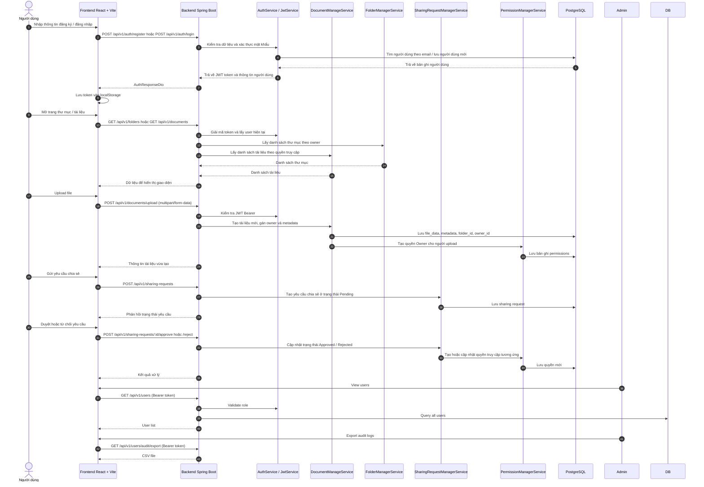
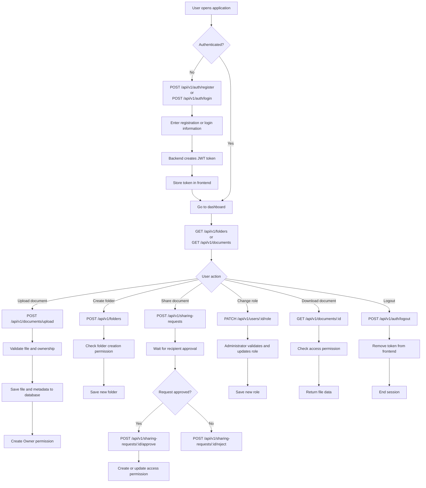
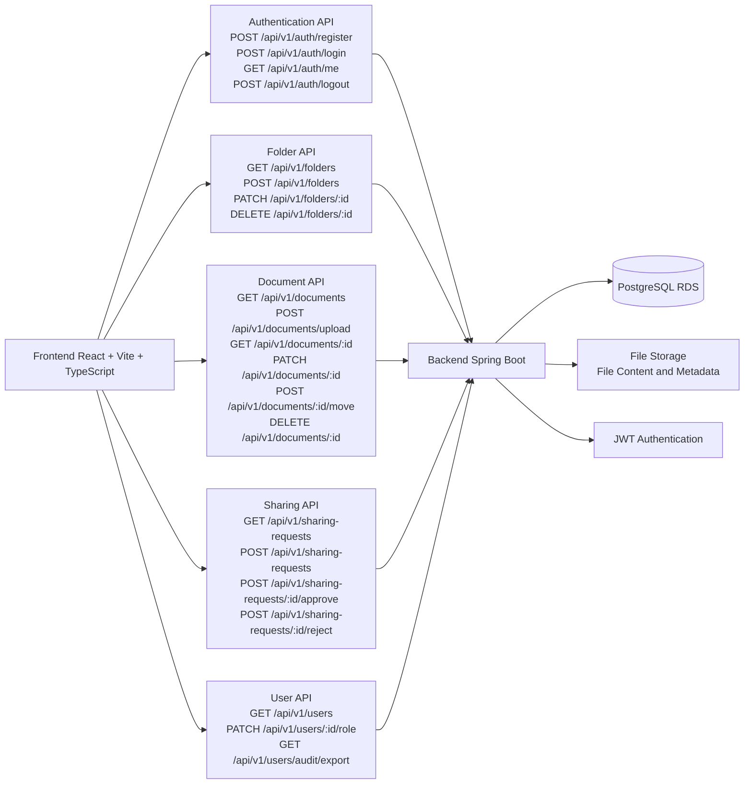

# Sơ đồ kiến trúc VaultSystem

## 1) Use Case Diagram

```mermaid
flowchart LR
    actor User
    actor Admin
    actor System

    User --> UC1[POST /api/v1/auth/register]
    User --> UC2[POST /api/v1/auth/login]
    User --> UC3[GET /api/v1/auth/me]
    User --> UC4[POST /api/v1/auth/logout]
    User --> UC5[GET /api/v1/folders]
    User --> UC6[POST /api/v1/folders]
    User --> UC7[PATCH /api/v1/folders/:id]
    User --> UC8[DELETE /api/v1/folders/:id]
    User --> UC9[POST /api/v1/documents/upload]
    User --> UC10[GET /api/v1/documents]
    User --> UC11[GET /api/v1/documents/:id]
    User --> UC12[PATCH /api/v1/documents/:id]
    User --> UC13[POST /api/v1/documents/:id/move]
    User --> UC14[DELETE /api/v1/documents/:id]
    User --> UC15[GET /api/v1/permissions]
    User --> UC16[POST /api/v1/sharing-requests]
    User --> UC17[GET /api/v1/sharing-requests]
    User --> UC18[PATCH /api/v1/sharing-requests/:id/approve]
    User --> UC19[PATCH /api/v1/sharing-requests/:id/reject]
    User --> UC20[GET /api/v1/users]
    User --> UC21[PATCH /api/v1/users/:id/role]
    User --> UC22[GET /api/v1/users/audit/export]

    Admin --> UC23[Admin-only role enforcement]
    Admin --> UC24[User governance and role changes]
    Admin --> UC25[Audit log export]

    System --> UC26[JWT bearer validation]
    System --> UC27[Permission checks on document access]
    System --> UC28[Database persistence in PostgreSQL]
```

## 2) Sequence Diagram



## 3) Class Diagram

```mermaid
classDiagram

    class AuthController {
        -AuthService authService
        -JwtService jwtService
        +register(request) ResponseEntity
        +login(request) ResponseEntity
        +getCurrentUser(authHeader) ResponseEntity
        +logout(authHeader) ResponseEntity
        +forgotPassword(body) ResponseEntity
        +resetPassword(body) ResponseEntity
        -extractToken(authHeader) String
    }

    class AuthService {
        -UserManagerRepository userRepository
        -JwtService jwtService
        -PasswordEncoder passwordEncoder
        +register(request) AuthResponseDto
        +login(request) AuthResponseDto
        +getCurrentUser(token) UserManager
        +logout(token) void
        -toUserManager(user) UserManager
    }

    class JwtService {
        -String jwtSecret
        -long jwtExpirationMs
        +generateToken(user) String
        +extractUserId(token) Integer
        +extractRole(token) String
        +isTokenValid(token) boolean
        -extractAllClaims(token) Claims
        -getSigningKey() SecretKey
    }

    class FolderManagerController {
        -FolderManagerService folderManagerService
        -AuthService authService
        -JwtService jwtService
        +getAllFolders(authorization) List~FolderManager~
        +getFolderById(id, authorization) FolderManager
        +createFolder(folder, authorization) FolderManager
        +updateFolder(id, folder, authorization) FolderManager
        +deleteFolder(id, authorization) void
        -extractToken(authHeader) String
        -currentUserIdFromHeader(authorization) Integer
    }

    class FolderManagerService {
        -FolderManagerRepository folderManagerRepository
        -UserManagerRepository userManagerRepository
        +getAllFolders(currentUserId) List~FolderManager~
        +getFolderById(id, currentUserId) FolderManager
        +createFolder(folder, currentUserId) FolderManager
        +updateFolder(id, updatedFolder, currentUserId) FolderManager
        +deleteFolderById(id, currentUserId) void
    }

    class PermissionManagerController {
        -PermissionManagerService permissionManagerService
        +getPermissions(docId, userId) List~PermissionResponseDto~
        +getPermissionById(id) PermissionResponseDto
        +createPermission(request) PermissionResponseDto
        +updatePermission(id, request) PermissionResponseDto
        +deletePermission(id) void
    }

    class PermissionManagerService {
        -PermissionManagerRepository permissionManagerRepository
        -DocumentManageRepository documentManageRepository
        -UserManagerRepository userManagerRepository
        +getAllPermissions() List~PermissionManager~
        +getPermissionsByDocumentId(docId) List~PermissionManager~
        +getPermissionByDocumentAndUser(docId, userId) Optional~PermissionManager~
        +getPermissions(docId, userId) List~PermissionManager~
        +getPermissionById(id) PermissionManager
        +createPermission(docId, userId, accessType) PermissionManager
        +updatePermission(id, accessType) PermissionManager
        +deletePermissionById(id) void
        +toDto(permission) PermissionResponseDto
        -normalizeAccessType(raw) String
    }

    class SharingRequestManagerController {
        -SharingRequestManagerService sharingRequestManagerService
        -JwtService jwtService
        +getSharingRequests(authHeader, status, docId) List~SharingRequestResponseDto~
        +getSharingRequestById(id) SharingRequestResponseDto
        +createSharingRequest(authHeader, request) SharingRequestResponseDto
        +approveSharingRequest(authHeader, id) SharingRequestResponseDto
        +rejectSharingRequest(authHeader, id) SharingRequestResponseDto
        +handleIllegalArgument(ex) ResponseEntity
        -extractToken(authHeader) String
    }

    class SharingRequestManagerService {
        -SharingRequestManagerRepository sharingRequestManagerRepository
        -DocumentManageRepository documentManageRepository
        -UserManagerRepository userManagerRepository
        -PermissionManagerRepository permissionManagerRepository
        +getAllSharingRequests() List~SharingRequestManager~
        +getSharingRequestsByStatus(status) List~SharingRequestManager~
        +getSharingRequestsByDocumentId(docId) List~SharingRequestManager~
        +getSharingRequestsByStatusAndDocumentId(status, docId) List~SharingRequestManager~
        +getIncomingRequests(actorUserId, status, docId) List~SharingRequestManager~
        +getSharingRequestById(id) SharingRequestManager
        +createSharingRequest(docId, recipientUserId, permission, actorUserId) SharingRequestManager
        +approveSharingRequest(id, actorUserId) SharingRequestManager
        +rejectSharingRequest(id, actorUserId) SharingRequestManager
        +toDto(request) SharingRequestResponseDto
        -normalizeStatus(raw) String
        -normalizeAccessType(raw) String
    }

    class UserManagerController {
        -UserManagerService userManagerService
        +getAllUsers(q) List~UserManager~
        +getUserById(id) UserManager
        +exportAuditLogs() ResponseEntity
        +updateUserRole(id, user) UserManager
        +deleteUser(id) void
    }

    class UserManagerService {
        -UserManagerRepository userManagerRepository
        +getAllUsers() List~UserManager~
        +getUserById(id) UserManager
        +createUser(user) UserManager
        +updateUser(id, updatedUser) UserManager
        +deleteUserById(id) void
    }

    class DocumentManageService {
        -DocumentManageRepository documentManageRepository
        -FolderManagerRepository folderManagerRepository
        -UserManagerRepository userManagerRepository
        -PermissionManagerRepository permissionManagerRepository
        +getDocuments(currentUserId, folderId, q) List~DocumentManage~
        +searchDocuments(currentUserId, q) List~DocumentManage~
        +getDocumentById(id, currentUserId) DocumentManage
        +createDocument(file, folderId, title, currentUserId) DocumentManage
        +updateDocument(id, updatedDocument, currentUserId) DocumentManage
        +moveDocument(id, folderId, currentUserId) DocumentManage
        +deleteDocumentById(id, currentUserId) void
        -resolveAccessType(doc, userId) String
        -requireCanView(doc, userId) void
        -requireCanEdit(doc, userId) void
        -requireIsOwner(doc, userId) void
        -isAdmin(user) boolean
    }

    class UserManager {
        +Integer userId
        +String name
        +String email
        +String password
        +String role
        +LocalDateTime createdAt
        +List~DocumentManage~ documents
        +List~FolderManager~ folders
        +List~PermissionManager~ permissions
        +List~SharingRequestManager~ sharingRequests
    }

    class FolderManager {
        +Integer folderId
        +String name
        +LocalDateTime createdAt
        +UserManager owner
        +List~DocumentManage~ documents
    }

    class DocumentManage {
        +Integer docId
        +String title
        +Map metadata
        +LocalDateTime createdAt
        +LocalDateTime updatedAt
        +byte[] fileData
        +String originalFilename
        +String contentType
        +UserManager owner
        +FolderManager folder
        +List~PermissionManager~ permissions
        +List~SharingRequestManager~ sharingRequests
    }

    class PermissionManager {
        +Integer permId
        +String accessType
        +DocumentManage document
        +UserManager user
    }

    class SharingRequestManager {
        +Integer sharingReqId
        +String accessType
        +String status
        +LocalDateTime createdAt
        +LocalDateTime updatedAt
        +DocumentManage document
        +UserManager user
        +UserManager sharingUser
    }

    AuthController --> AuthService
    AuthController --> JwtService

    FolderManagerController --> FolderManagerService
    FolderManagerController --> AuthService
    FolderManagerController --> JwtService

    PermissionManagerController --> PermissionManagerService

    SharingRequestManagerController --> SharingRequestManagerService
    SharingRequestManagerController --> JwtService

    UserManagerController --> UserManagerService

    DocumentManageService --> DocumentManage

    AuthService --> UserManager
    AuthService --> JwtService

    FolderManagerService --> FolderManager
    FolderManagerService --> UserManager

    PermissionManagerService --> PermissionManager
    PermissionManagerService --> DocumentManage
    PermissionManagerService --> UserManager

    SharingRequestManagerService --> SharingRequestManager
    SharingRequestManagerService --> DocumentManage
    SharingRequestManagerService --> UserManager
    SharingRequestManagerService --> PermissionManager

    UserManagerService --> UserManager

    UserManager "1" --> "0..*" DocumentManage
    UserManager "1" --> "0..*" FolderManager
    UserManager "1" --> "0..*" PermissionManager
    UserManager "1" --> "0..*" SharingRequestManager

    FolderManager "1" --> "0..*" DocumentManage
    DocumentManage "1" --> "0..*" PermissionManager
    DocumentManage "1" --> "0..*" SharingRequestManager
```



## 4) Activity Diagram



## 5) High-Level App Context


